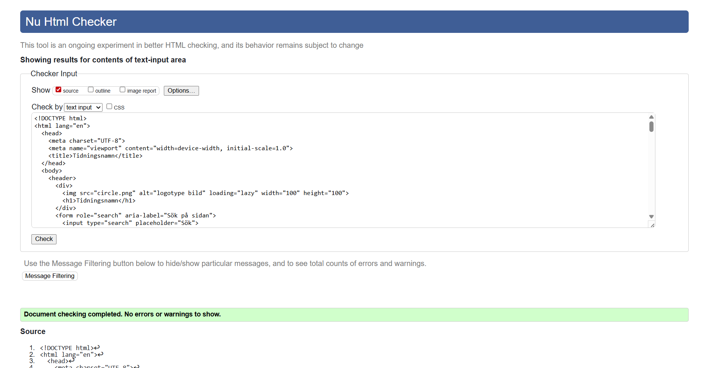

# Inlämningsuppgift 1

## Tidsuppskattning 
### Todos och story Points

| Uppgift                                     | Estimat |
|---------------------------------------------|---------|
| Skapa HTML-struktur för headern             | 1 SP    |
| Skapa artikel med bild, byline och brödtext | 1 SP    |
| Lägga till citat och knappen "Läs mer"      | 0,5 SP  |
| Skapa formulär i aside                      | 1 SP    |
| Validera och korrigera                      | 1 SP  |

### Tidslogg

#### Dag 1:
- Start: 09:00
- Rast : 11:30 - 13:00
- Slut : 15:50
- Rast : 15:50 - 17:00
- Start: 17:00
- Slut : 19:00

#### Dag 2:
- Start: 14:00
- Slut : 17:00

### Totalt arbets tid : ca 11 timmar

## Tillgänglighetsgranskning (AI vs webbläsarens verktyg)

**AI-fynd:**
- Byt `lang="en"` till `lang="sv"`.
- Märk upp söket med `role="search"` och ge input ett tillgängligt namn (`aria-label="Sök"` eller synlig `<label>`).
- Korrigera formulär: `type="email"` för e-post, `type="tel"` för telefon, förenkla id till `epost`. Lägg `autocomplete` och `required`.
- Använd `<button type="submit">` i stället för länk för "Skicka".
- Lägg innehållet i `<main>…</main>`.
- Fyll `select` med alternativ och en första plats­hållare.
- Stavning: "Välj ämne", "GDPR och villkor".

**DevTools/Lighthouse-fynd:**
- Bekräftar språkfel (`lang`) och landmark-brister.
- Visar eventuella kontrast- och fokusproblem (gäller mest med CSS).
- Axe/Accessibility-panel varnar för formulärfält utan korrekt label/namn.

**Slutsats:** AI gav semantiska och textmässiga förbättringar; DevTools verifierade språk/landmarks och kan mäta kontrast/fokus. Jag har uppdaterat koden enligt ovan.

## Valideringsresultat

